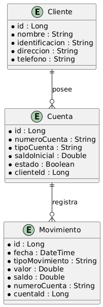

# ECUADOR-CUENTA-MOV 
## Cuentas y Movimientos - API REST

## Descripción
La API de Cuentas y Movimientos es un sistema bancario que permite la gestión de cuentas de usuarios, registrar movimientos financieros y generar reportes. Esta aplicación se comunica con el servicio **EcuadorPersonas** para obtener información de los clientes.

Esta aplicacion se utiliza con la api de EcuadorPerosnas que se encuentra en el siguiente repositorio:
* https://github.com/julianest/ecuadorPerson

## Características Principales
- Creación, actualización y eliminación de cuentas bancarias.
- Registro de movimientos financieros (depósitos y retiros).
- Generación de reportes detallados de transacciones.
- Integración con el servicio **EcuadorPersonas** para validación de clientes.
- Documentación de API con OpenAPI/Swagger.
- Base de datos en memoria H2 para pruebas y desarrollo.
- Despliegue automatizado con Docker y GitHub Container Registry (GHCR).

## Tecnologías Utilizadas
- **Spring Boot** (Web, Data JPA, DevTools)
- **H2 Database** (Base de datos en memoria para pruebas)
- **Lombok** (Para reducir la escritura de código repetitivo)
- **SpringDoc OpenAPI** (Para la documentación de API REST)
- **Mockito, JUnit, Spring RestDocs** (Para pruebas)
- **Docker** (Para la creación de contenedores y despliegue en GHCR)

## Estructura del Proyecto
```
├── config/            # Configuraciones generales de la aplicación
├── controllers/       # Controladores REST
├── domains/           # Lógica de negocio y modelo de datos
│   ├── dtos/         # Objetos de transferencia de datos
│   ├── services/     # Lógica de negocio y servicios
│   ├── entities/     # Entidades JPA
│   ├── repositories/ # Repositorios JPA
├── exceptions/        # Manejo centralizado de excepciones
├── utils/             # Utilidades generales
└── ...
```

## Diagrama de Flujo


## MER


## Instalación y Configuración
### Requisitos Previos
- Tener instalado **Java 17** o superior
- Tener **Maven** configurado
- Contar con **Docker** y **Podman** en caso de usar contenedores

### Pasos de Instalación
1. Clonar el repositorio:
   ```sh
   git clone https://github.com/julianest/ecuadorCtaMov
   cd cuentas-movimientos
   ```
2. Construir el proyecto con Maven:
   ```sh
   mvn clean install
   ```
3. Ejecutar la aplicación:
   ```sh
   mvn spring-boot:run
   ```
4. Acceder a la documentación de la API:
    - [Swagger UI](http://localhost:8082/swagger-ui.html)

## Despliegue con Docker
Para crear la imagen y subirla a **GitHub Container Registry (GHCR)**, ejecutar:
```sh
podman build -t ghcr.io/usuario/cuentas-movimientos:latest .
podman push ghcr.io/usuario/cuentas-movimientos:latest
```

## Endpoints Principales

### Cuentas
| Método | Endpoint              | Descripción |
|---------|----------------------|-------------|
| POST    | `/cuentas`           | Crear una nueva cuenta |
| GET     | `/cuentas/{id}`      | Obtener información de una cuenta |
| PUT     | `/cuentas/{id}`      | Actualizar una cuenta existente |
| DELETE  | `/cuentas/{id}`      | Eliminar una cuenta |

### Movimientos
| Método | Endpoint                      | Descripción |
|---------|------------------------------|-------------|
| POST    | `/movimientos`               | Registrar un movimiento |
| GET     | `/movimientos/{numeroCuenta}`| Obtener el historial de movimientos |

### Ejemplo de Petición para Registrar un Movimiento
```json
{
  "numeroCuenta": "225487",
  "tipo": "Corriente",
  "saldoInicial": 100,
  "estado": true,
  "movimiento": 600,
  "saldoDisponible": 700
}
```

### Coleccion Postman 
- [EcuadorPruebaCuentaMov.postman_collection.json](src/main/resources/EcuadorPruebaCuentaMov.postman_collection.json)


## Autor
- **Julian Huerfano** - Desarrollador del proyecto

## Contribuciones
Las contribuciones son bienvenidas. Para colaborar, siga estos pasos:
1. Haga un fork del repositorio
2. Cree una rama con la nueva funcionalidad (`git checkout -b feature-nueva-funcionalidad`)
3. Realice los cambios y haga commit (`git commit -m 'Agregada nueva funcionalidad'`)
4. Envie un pull request

---
Este proyecto es de código abierto y está disponible bajo la licencia MIT.

